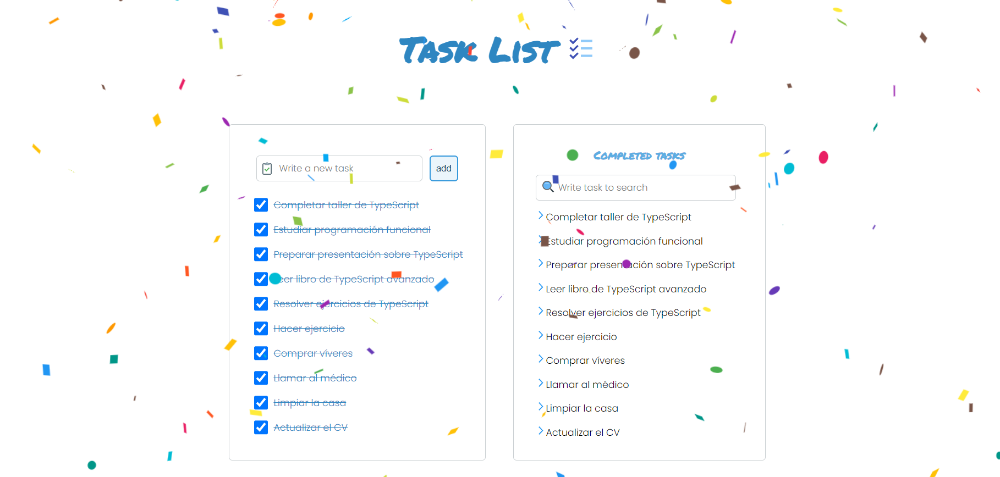
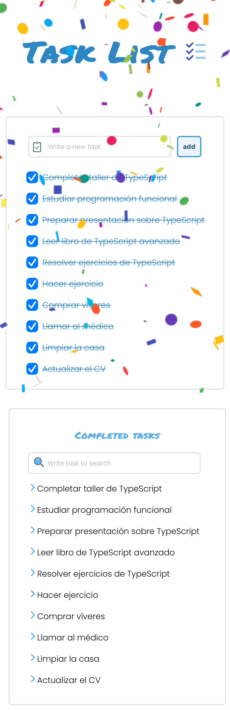

# Typescript-React Tasklist App 🚀  
## Table of contents :page_facing_up:
- [Overview](#overview)
  - [Installation](#Installation)  
  - [The challenge](#the-challenge)
  - [Screenshot](#screenshot)
- [My process](#my-process)
  - [Built with](#built-with)
  - [What I learned](#what-i-learned)
  - [Continued development](#continued-development)
  - [Useful resources](#useful-resources)
- [Author](#author)

## Overview :writing_hand:
This is a tasklist app built using Vite, React, TypeScript, and Sass. The application allows users to manage their tasks by adding new tasks and marking tasks as completed. Completed tasks are moved to a separate "Completed Tasks" list.

### Installation :gear:
To get started with the project, follow these steps:

1. Clone the repository:
```shell
git clone git@github.com:erickfabiandev/TaskList.git
  ```
2. Navigate to the project directory:
```shell
cd TaskList
 ```
3. Install the dependencies: 
```shell
 yarn install
 ```
4. Start the application: 
```shell
 yarn run dev
  ```
The application will automatically open in your default web browser, ready for exploration.

### The Challenge :weight_lifting_man:
The challenge was to create a tasklist app that provides a user-friendly interface for managing tasks. The main focus was on implementing task addition, completion, and visual organization of tasks.

### Screenshot 📷 
Here is a screenshot of the project's interface:

***desktop view***



***mobile view***




## My Process :mountain:

During this project, I gained valuable insights in the following areas:

* Setup: Created the project using Vite with the React template. Set up the basic file structure.
* Component Design: Designed the tasklist and task components, including their layout and functionality.
* Styling: Used Sass for styling to create a visually appealing and responsive design.
* Task Management: Implemented the logic for adding and completing tasks. Completed tasks are automatically moved to the "Completed Tasks" list.
* Testing: Thoroughly tested the app for different use cases and edge cases to ensure smooth functionality.

### Built With :hammer_and_wrench:
The project was built using the following technologies:

* React
* Sass
* TypeScrpit
* Vite

### What I Learned :microscope:
Through this project, I gained a deeper understanding of:

* Creating a responsive and user-friendly interface using React components.
* Managing and manipulating state in React using hooks and context.
* Integrating TypeScript for type-safe development.
* Using Sass to enhance the styling process and maintainable CSS code.
* Working with Vite to optimize the development workflow.

### Continued Development :briefcase:
While the current version of the app is functional, there are several areas for potential improvement:

* Data Persistence: Implementing data persistence using a backend or browser storage for task persistence across sessions.
* Drag and Drop: Adding drag-and-drop functionality for task reordering.
* User Authentication: Introducing user authentication to allow multiple users to manage their own tasklists.
* Customization: Allowing users to customize the app's appearance and behavior.

### Useful Resources :sos:
During the development of this project, the following resources were helpful:

* Official React documentation: https://reactjs.org/docs
* Official Sass documentation: https://sass-lang.com/documentation
* TypeScript Documentation : https://www.typescriptlang.org/docs/
* React Icons: https://react-icons.github.io/react-icons/

## Author :nerd_face:

This project created by erickfabiandev.
- [erickfabiandev](https:erickfabiandev.com)
